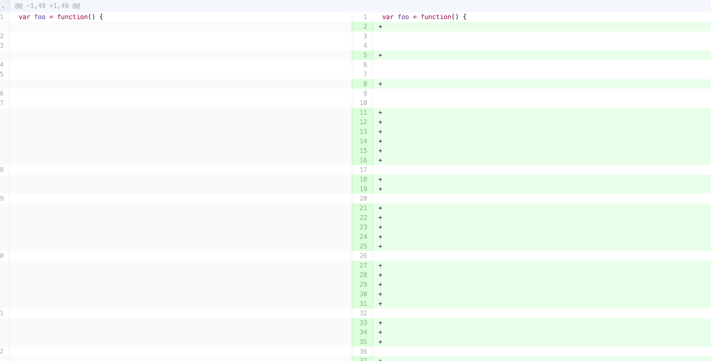

## Synopsis

Less Noise is a project designed to clean up diffs. To use it, simply refresh when reviewing a diff to remove the whitespace and look at the meat of the diff.

## Motivation

This project came from a discussion with a Sr. Engineer in which I wanted a sanity check on a PR. The files I was editing were improperly indented so on save, my text editor converted the file to meet our whitespace standards. I shared the link and he let me know I could append a whitespace parameter to the link to get rid of all of the fluff and review the actual changes. My first thought was how cool it would be if that could be automated....

Get to the meat!
### Before and After
 

## Installation

Find me in the chrome app store!

## Contributors

Feel free to open a PR and start some dialogue! The first thing that comes to mine is whitelisting the appropriate URL's in other services like BitBucket and Bitlab, etc along with the appropriate logic to ensure the matching parameters are appended.

## License

The MIT License (MIT)

Copyright (c) [2016] [fullname]

Permission is hereby granted, free of charge, to any person obtaining a copy
of this software and associated documentation files (the "Software"), to deal
in the Software without restriction, including without limitation the rights
to use, copy, modify, merge, publish, distribute, sublicense, and/or sell
copies of the Software, and to permit persons to whom the Software is
furnished to do so, subject to the following conditions:

The above copyright notice and this permission notice shall be included in all
copies or substantial portions of the Software.

THE SOFTWARE IS PROVIDED "AS IS", WITHOUT WARRANTY OF ANY KIND, EXPRESS OR
IMPLIED, INCLUDING BUT NOT LIMITED TO THE WARRANTIES OF MERCHANTABILITY,
FITNESS FOR A PARTICULAR PURPOSE AND NONINFRINGEMENT. IN NO EVENT SHALL THE
AUTHORS OR COPYRIGHT HOLDERS BE LIABLE FOR ANY CLAIM, DAMAGES OR OTHER
LIABILITY, WHETHER IN AN ACTION OF CONTRACT, TORT OR OTHERWISE, ARISING FROM,
OUT OF OR IN CONNECTION WITH THE SOFTWARE OR THE USE OR OTHER DEALINGS IN THE
SOFTWARE.
